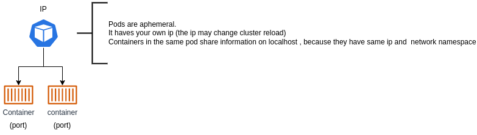
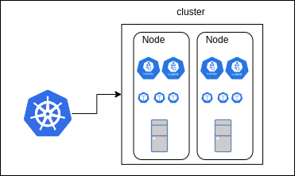
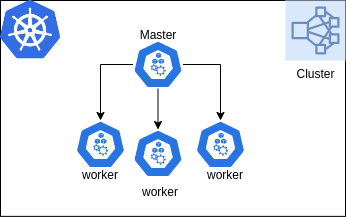
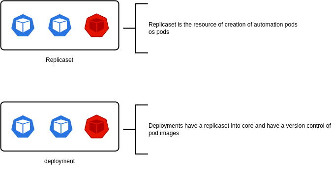

# About this reposity

Hello guys, in this repository I'm trying to learn about kubernets concepts and how this container orchestration plataform maybe help us in many tasks, making DevOps more simple and less caotic.

## Required software to works

- minikube: That creates a cluster with a single node 
    - virtual machine (virtualbox)
    - container manager (Docker)

- kubectl: You may want to use the kubectl included on minikube instalation, but for convenience, you can install directly

- Vscode kubernets extension (optional)

## Minikube starting

After install minikube and kubectl you must execute this command:

- minikube start --drive=<chosed_drive>

other useful commands: execute minikube help and see these.

### Connect to minikube cluster by ssh

getting the cluster ip: minikube ip
connect to the cluser: ssh docker@ip

complement: the default passaword of minikube cluster is 'tcuser'

# Kubernets concepts:

## Pod

It's  the smallest unit in the kubernets world.
For example, in the docker world, container is the smallest unit.
the container is inside the pod.
Each pod runs in the one server (one pod per server)

Pods share:

- Ip
- Volume

Use cases:

- single container per pod

The pod ip isn't enabled to outside node access and it is recommended to access it with kubernets services because the pod ip is ephemeral.

## Cluster

Cluster is composed by Nodes.

The types of Nodes:

- master: It management, mantain and receive commands from api kubernets 
- worker: execute pods and aplications

### Cluster management

The cluster is managemented by kubectl (kube control). This is a command line tool(cli) that allows control on local or remote 
kubernets cluster.

## Deployment 

The deployment make sense when you want management pods automatic, realizing actions as desire and scale quantity of the pods

## Service

This resources make your aplication available to external access or on ClusterIP case defines only one local to access any
pods inside the cluster.

Types:
    - ClusterIP : This allows to connect from  any kubernets pods inside of cluster
        
        - Recommended to databases inside the cluster.

    - NodePort: This allows to connect from any kubernets pods inside cluster and allows external connects too.
    - LoadBalancer

## Namespace

This resource make group of resources to separete them.

## Context

This resource switch between cluster configurations

## General documentation and reference

- https://www.freecodecamp.org/news/the-kubernetes-handbook/
- https://www.youtube.com/watch?v=d6WC5n9G_sM
